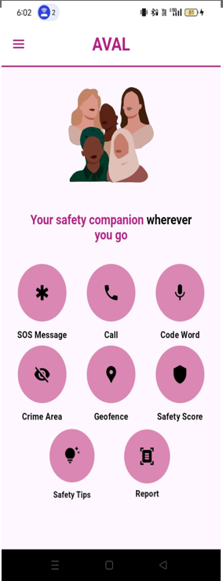

# AVAL - Women Safety App 🚨

## Overview
The **Women Safety App** is a real-time safety application designed to enhance security for women by providing emergency alerts, geofencing, crime hotspot detection, and AI-powered assistance. The app ensures quick response and proactive safety measures.

## Features ✨
- **🚨 Emergency SOS** – Send instant alerts via SMS and calls to emergency contacts.
- **📍 Real-time Location Tracking** – Continuously monitors user location for safety.
- **🛑 Danger Zone Alerts** – Notifies users if they enter crime-prone areas.
- **📡 Geofence Monitoring** – Sets up safety boundaries with real-time alerts.
- **📞 Voice-Activated Emergency Call** – Hands-free SOS trigger for quick response.
- **🤖 AI-Powered Health Advisor** – Provides symptom analysis, relaxation tips and support.
- **🛤 Safer Route Suggestions** – Uses crime data to suggest secure travel routes.
- **👥 Multiple Emergency Contacts** – Allows users to add and manage emergency contacts.
- **📊 AI-based Safety Score & Report** – Users can upload an image, check safety levels, and receive a safety score.
- **🗺️ Heatmap & Safety Report** – Generates a heatmap based on safety scores and provides recommendations upon clicking a marker.
- **🧠 Smart Safety Advisor** – Offers safety tips for traveling based on crime rates in different areas.
- **⚠️ Crime Hotspot Detection** – Highlights high-crime areas for better situational awareness.
- **🚧 Geofencing & Boundary Alerts** – Allows users to set up alerts when they cross predefined safe zones.

## Tech Stack 🛠
### **Frontend**
- Flutter (Dart)
- Firebase Authentication
- Google Maps API

### **Backend**
- Flask (Python)
- Twilio API (for SMS alerts)
- Crime Data API (for danger zone detection)

## Installation 🚀
### **Prerequisites**
- Flutter SDK
- Android Studio / VS Code
- Firebase Account
- Python (for backend services)
- Virtual Environment (`venv`)

## Environment Variables 🌍
To run this project, you need to set up a `.env` file in the backend directory with the following credentials:

```
TWILIO_ACCOUNT_SID=your_account_sid
TWILIO_AUTH_TOKEN=your_auth_token
TWILIO_PHONE_NUMBER=your_twilio_number
RECIPIENT_NUMBER=recipient_phone_number
TWILIO_TWIML_URL=your_twiml_url
```

### **Setup Instructions**
1. **Clone the repository**
   ```bash
   git clone https://github.com/Jothika1526/Women_safety_app.git
   cd Women_safety_app
   ```

2. **Set up the Flutter environment**
   ```bash
   flutter pub get
   ```

3. **Run the Flutter app**
   ```bash
   flutter run
   ```

4. **Set up the backend**
   ```bash
   cd backend
   python -m venv venv
   source venv/bin/activate  # On Windows: venv\Scripts\activate
   pip install -r requirements.txt
   ```

## How It Works 🎯
1. **User Registration & Profile Setup**
   - The user registers an account using a phone number and sets up an emergency contact list.
   - Personal details, including name and emergency contacts, are stored securely.

2. **Real-time Location Tracking**
   - The app continuously tracks the user’s real-time location using GPS.
   - If the user enters a high-risk area, the app sends a warning notification.

3. **Emergency SOS Activation**
   - Users can manually trigger an SOS alert by pressing a button or using a voice command.
   - The app sends an emergency SMS and call to registered contacts with the user's live location.
   - The backend system ensures timely delivery of messages using the Twilio API.

4. **AI-based Safety Score & Report**
   - Users upload an image to assess the safety of their surroundings.
   - The app generates a **safety score** based on AI analysis.
   - A heatmap is created using aggregated safety scores.
   - Clicking on a heatmap marker provides a detailed report with issues and recommendations.

5. **Smart Safety Advisor**
   - Provides safety tips for traveling from one place to another based on crime rates.
   - Helps users make informed decisions about their routes.

6. **Crime Hotspot Detection**
   - Uses real-time crime data to highlight **high-risk areas**.
   - Users receive alerts if they enter a crime hotspot.

7. **Geofence Monitoring & Boundary Alerts**
   - Users can define custom geofence areas (such as home, school, or workplace).
   - If they move outside the safe zone unexpectedly, an alert is triggered.

8. **Safer Route Suggestions**
   - The app calculates a secure path by analyzing real-time crime data.
   - It provides route recommendations to avoid high-risk zones.

9.  **Multiple Emergency Contacts**
   - Users can add multiple contacts to receive alerts during emergencies.
   - Contacts can be selected from the phonebook or entered manually.

## Screenshots 📸
<table>
  <tr>
    <td></td>
    <td></td>
    <td></td>
    <td></td>
  </tr>
  <tr>
    <td></td>
    <td></td>
    <td></td>
    <!-- <td></td> -->
     <td></td>
  </tr>
  <tr>
    
    <td></td>
    <td></td>
    <td></td>
  </tr>
  <tr>
    <td></td>
    <td></td>
    <td></td>
    <td></td>
  </tr>
</table>

## Future Enhancements 🔮
- **AI-based Threat Prediction** using ML models
- **Integration with Law Enforcement Agencies** for better response
- **Wearable Device Integration** for seamless SOS triggers

## License 📜
This project is **open-source** under the [License](LICENSE).

---
> *Empowering safety with technology!* 🚀


